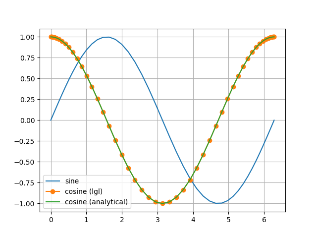

# Legendre Gauss Lobatto collocation

## Description
The `lglpsmethods.py` computes LGL quadrature, differentiation and nodes, given grid size or number of intervals (N). To use the code,
import the `LGL` class from the `lglpsmethods.py` module. 

## Example

The following exercise demonstrates 
* numerical derivative computation of the sine function on the interval $[0,2\pi]$ and compares with the analytical solution
* verfies integral of sine over the interval is zero numerically and analytically

### python code

```
# plotting results
import matplotlib.pyplot as plt
# initial and final point
x0=0
xf=2*np.pi
# grid size
N=50
# LGL object which has the diff. matrix, quadrature weights and LGL collocation points
lgl=LGL(N+1)
# domain transformation [-1,1]->[x0,xf]
x=lgl.tau*(xf-x0)/2+(xf+x0)/2
# sample the function 
y=np.sin(x)
# compute derivative from differentiation matrix
y_dot=2/(xf-x0)*lgl.D@y.reshape(N+1,1)
# plot function and its numerical and analytical derivative
plt.plot(x,y,label='sine')
plt.plot(x,y_dot,'-o',label='cosine (lgl)')
plt.plot(x,np.cos(x),label='cosine (analytical)')
#plt.plot(x,y_dot-np.cos(x))
plt.legend()
plt.grid()
plt.show()
print(lgl.wi.T@y)
```

### output




```
quadrature: [[1.43226551e-17]]
```
