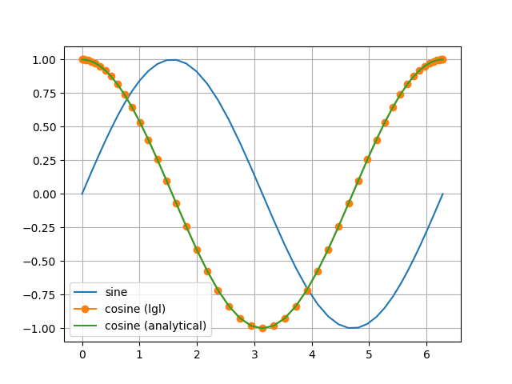

# lgltools

## Description
The `lgltoolss.py` is a python package that computes LGL nodes, quadrature weights, differentiation matrix and integration matrix (Lagrange and Birkhoff based). 

## Installation
1. creata a virtual environment or use an existing one
2. clone the repository and move to the root directory of the project
3. run `pip install .`

## Example

1. compute derivative of $(\sin (x))$ using the differentiation matrix
2. compare with the analytical solution $(\cos (x))$
3. compute $\int_{0}^{2\pi}\sin(x)dx$ using quadrature
4. compare with analytical solution (area under curve is zero)
5. last row of integration matrices (Lagrange and Birkhoff) are LGL quadrature

### Python code

```
# plotting results
import matplotlib.pyplot as plt
# initial and final point
x0=0
xf=2*np.pi
# grid size
N=50
# LGL object which has the diff. matrix, quadrature weights and LGL collocation points
lgl=LGL(N+1)
# domain transformation [-1,1]->[x0,xf]
x=lgl.tau*(xf-x0)/2+(xf+x0)/2
# sample the function 
y=np.sin(x)
# compute derivative from differentiation matrix
y_dot=2/(xf-x0)*lgl.D@y.reshape(N+1,1)
# plot function and its numerical and analytical derivative
plt.plot(x,y,label='sine')
plt.plot(x,y_dot,'-o',label='cosine (lgl)')
plt.plot(x,np.cos(x),label='cosine (analytical)')
#plt.plot(x,y_dot-np.cos(x))
plt.legend()
plt.grid()
plt.show()
print(lgl.wi.T@y)
```

### Output



```
quadrature: [[1.43226551e-17]]
```

## Integration matrices based on Birkhoff and Lagrange interpolation

In many applications, when higher resolution of a grid is a requirement, LGL collocation based on differentiation matrices do not scale well due to ill-conditioned operation and typically limited to `n<=100`. For higher resolution, perform the integration operation (e.g., on ode) to compute the solution. `lgltools` has a Lagrange and Birkhoff-based integration matrix. The ode state rate is approximated using Lagrange interpolant in a Lagrange-based integration matrix. On the other hand, a Birkhoff interpolation using the initial state and state rates at remainder nodes leads to a Birkhoff integration matrix. While both offer better conditioning than the differentiation matrix-based methods, the Birkhoff integration matrix is superior to Lagrange.


